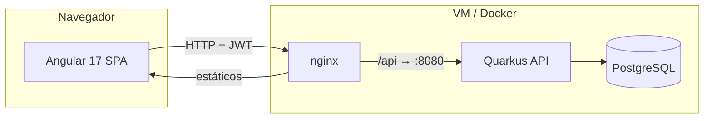
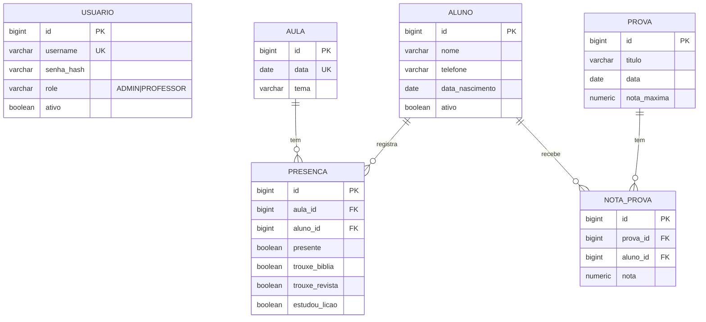
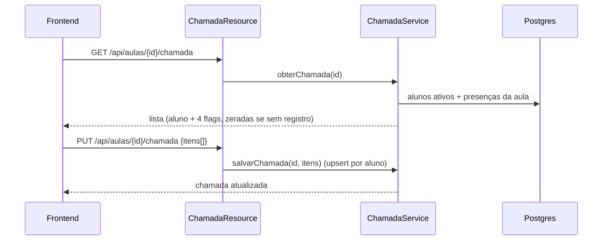

# Arquitetura — EBD Adultos (ICEV Samambaia)

Documento de referência técnica. Leia antes de mudanças estruturais (novas entidades,
mudanças de modelo, novos módulos).

## 1. Visão geral

- Em **produção** o nginx serve os arquivos do Angular e faz proxy de `/api` para o backend
  (mesma origem → sem CORS). Em **dev**, o Angular (`:4200`) chama o backend (`:8080`)
  diretamente e o CORS está liberado no `application.properties`.
- Autenticação **stateless** via JWT no header `Authorization: Bearer <token>`.

## 2. Modelo de dados

Regras importantes:
- `PRESENCA` tem **única** `(aula_id, aluno_id)` — um registro por aluno por aula (upsert na chamada).
- `NOTA_PROVA` tem **única** `(prova_id, aluno_id)`.
- `AULA.data` é **única** (uma EBD por data).
- FKs de `PRESENCA` e `NOTA_PROVA` são `ON DELETE CASCADE`: excluir aluno/aula/prova remove os
  registros dependentes.
- Schema versionado em `backend/src/main/resources/db/migration/V1__schema.sql`.
  **Nunca edite a V1**; toda mudança é uma nova migration (`V2__...`).

## 3. Backend (Quarkus)

Camadas, de fora para dentro:

| Camada | Papel | Exemplos |
|---|---|---|
| `resource/` | Endpoints JAX-RS, `@RolesAllowed`, validação `@Valid` | `AlunoResource`, `ChamadaResource` |
| `service/` | Regra de negócio, `@Transactional`, mapeamento DTO | `ChamadaService`, `DesafiosService` |
| `repository/` | Acesso a dados (Panache) | `AlunoRepository` |
| `model/` | Entidades JPA | `Aluno`, `Presenca` |
| `dto/` | Contratos de entrada/saída (records) | `ChamadaResponse` |

Componentes transversais:
- **Segurança**: `AuthService` valida senha (BCrypt via `BcryptUtil`) e `TokenService` emite o
  JWT (issuer, roles em `groups`, expiração de 8h). Verificação via `mp.jwt.*` + `publicKey.pem`.
- **Bootstrap**: `DataInitializer` (`@Observes StartupEvent`) cria `admin`/`professor` e alguns
  alunos de exemplo se as tabelas estiverem vazias.
- **Erros**: `ErrorMapper` converte `WebApplicationException` em JSON `{message, status}`.
- **Relatórios/Rankings**: `RelatorioService` e `DesafiosService` usam **JPQL com agregação**
  (`EntityManager`) — somam presença/itens por aluno e média de notas.

### Fluxo da chamada (exemplo)

## 4. Frontend (Angular 17)

- **Standalone components** + **signals** (sem NgModules, sem NgRx).
- **Roteamento** com lazy `loadComponent`; `authGuard`/`adminGuard` em `core/guards.ts`.
- **`core/api.service.ts`**: único ponto de acesso à API.
- **`core/auth.interceptor.ts`**: injeta o Bearer token e, em `401`, desloga e manda pro login.
- **`core/auth.service.ts`**: guarda token/username/role no `localStorage`, expõe signals
  `logado()`, `isAdmin()`, etc.
- **UI**: design system em `src/styles.scss` (variáveis CSS, `.btn`, `.card`, `.tabela`,
  `.modal`, `.badge`, `.toast`). Componentes usam classes utilitárias, sem libs externas.
- **Páginas**: `login`, `dashboard`, `alunos` (CRUD modal), `chamada` (grade de checkboxes),
  `relatorio` (filtro por período), `provas` (CRUD), `notas` (grade por prova), `desafios`
  (rankings com pódio). Layout em `layout/shell.component.ts` (menu lateral).

## 5. Decisões e justificativas

| Decisão | Por quê |
|---|---|
| Angular **17** (não 18+) | Node 18.13 do ambiente do Danilo só cobre o mínimo do 17 |
| Sem Angular Material | Menos peso/atrito de versão; SCSS custom dá controle total no MVP |
| Flyway com `generation=none` | Schema reproduzível e versionado (produção-like) |
| DTOs `record` + mapeamento manual | Evita expor entidades e problemas de lazy-loading na serialização |
| Seed no `DataInitializer` (runtime) | Cria usuários com hash BCrypt no boot, sem hardcode de hash no SQL |
| JWT RS256 com chaves em arquivo | Padrão do smallrye-jwt; chaves fora do Git, geradas no build Docker |
| Ranking/relatório via JPQL agregado | Uma query por métrica; simples e suficiente para o volume de uma classe |

## 6. Pontos de atenção / dívidas técnicas

- **Runtime ainda não validado com Postgres real** (ver CLAUDE.md §9) — prioridade.
- Sem testes automatizados ainda (só validação por build). Bom candidato: testes de
  `@QuarkusTest` para os services de chamada e ranking.
- Exclusão de aluno é **hard delete** (cascata). Se quiser preservar histórico, migrar para
  soft-delete usando o campo `ativo` também na exclusão.
- Rankings/relatórios consideram **todos** os alunos ativos e todo o período; filtros por
  trimestre/turma seriam evoluções naturais.
- Chave JWT antiga permanece no histórico do Git (repo privado). Purga de histórico é opcional.
