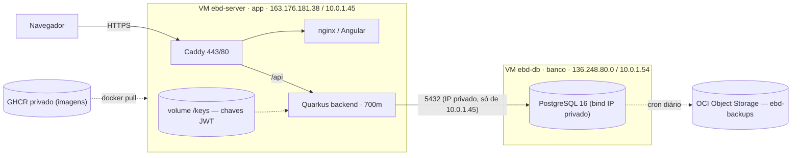

# Topologia de servidores (produção)

Referência **autoritativa** da infraestrutura atual. O app roda em **2 VMs Always Free** na Oracle
Cloud (OCI), com as imagens buildadas no CI e publicadas no GHCR. Os runbooks de cada etapa estão em
[`estagio1-ci-ghcr.md`](estagio1-ci-ghcr.md) (build/deploy) e [`estagio2-db-separado.md`](estagio2-db-separado.md) (split do banco).

## Visão geral



## As duas VMs

| | **ebd-server** (app) | **ebd-db** (banco) |
|---|---|---|
| Shape | `VM.Standard.E2.1.Micro` (x86, 1 OCPU / 1 GB, Always Free) | idem |
| IP público / privado | 163.176.181.38 / **10.0.1.45** | 136.248.80.0 / **10.0.1.54** |
| SO | Ubuntu 22.04 · 3 GB swap | Ubuntu 22.04 · swap |
| Roda | `caddy` + `frontend` (nginx) + `backend` | `db` (Postgres 16) |
| Compose | `docker-compose.app.yml` (dir `~/ebd-samambaia`) | `docker-compose.db.yml` (dir `~/ebd-db`) |
| Região / subnet | `sa-saopaulo-1` · mesma subnet pública das duas VMs | idem |

Ambas contam no **Always Free** (2 VMs AMD grátis) → **custo US$ 0**.

## Rede e segurança

- O backend conecta no Postgres pelo **IP privado** `10.0.1.54` (`EBD_DB_HOST` no `.env`).
- O Postgres é **vinculado ao IP privado** (`EBD_DB_BIND_IP=10.0.1.54`) — nunca fica no IP público.
- A porta **5432** é liberada **só para `10.0.1.45/32`** em duas camadas: Security List da subnet
  (regra de ingress) + `iptables` no host da `ebd-db`.
- HTTPS na app via **Caddy + Let's Encrypt** (domínio DuckDNS `ebd-ices.duckdns.org`), renovação automática.
- Chaves **JWT** montadas em runtime no backend (volume `./keys` → `/keys`, gravado pelo CD a partir dos
  secrets) — a imagem não carrega segredo e os tokens sobrevivem aos deploys.

## Deploy (build no CI, pull na VM)

Merge na `main` → CI → **CD** ([`cd.yml`](../.github/workflows/cd.yml)):

1. **build**: builda `ebd-backend` e `ebd-frontend` no runner e publica no **GHCR privado**.
2. **deploy**: na `ebd-server`, grava chaves em `./keys`, `docker login ghcr`, e
   `docker compose -f docker-compose.app.yml pull && up -d` (**sem build na VM** → ~2 min).

O Postgres da `ebd-db` só muda em manutenção (raro); o deploy da app **não toca o banco**.
Detalhes e ativação (secrets `EBD_GHCR_USER`/`EBD_GHCR_PAT`, rollback por `EBD_IMAGE_TAG`) em
[`estagio1-ci-ghcr.md`](estagio1-ci-ghcr.md).

## Backups

- **Local** na `ebd-db`: cron diário (`scripts/backup-ebd-db.sh`) → `~/backups/ebd-*.sql.gz`, valida
  integridade e retém os últimos 14. Instala com `scripts/setup-backup-ebd-db.sh` (roda do Mac).
- **Offsite**: cada backup sobe para o **OCI Object Storage** (bucket `ebd-backups`, 10 GB grátis) via
  **PAR write-only**; expira em 30 dias offsite. Instala com `scripts/setup-offsite-oci.sh`.
  ⏰ O PAR expira em 1 ano — reexecute o script para renovar.

Restaurar: baixe o `.sql.gz` (local ou do Object Storage) e
`gzip -dc arquivo.sql.gz | docker exec -i ebd-postgres sh -c 'PGPASSWORD="$POSTGRES_PASSWORD" psql -U "$POSTGRES_USER" -d "$POSTGRES_DB"'`.

## Operação rápida

```bash
# App (ebd-server)
ssh ubuntu@163.176.181.38 'cd ~/ebd-samambaia && docker compose -f docker-compose.app.yml ps'
ssh ubuntu@163.176.181.38 'cd ~/ebd-samambaia && docker compose -f docker-compose.app.yml logs -f backend'
# Banco (ebd-db)
ssh ubuntu@136.248.80.0 'docker exec -it ebd-postgres psql -U ebd -d ebd'
# Saúde
curl -s https://ebd-ices.duckdns.org/q/health
```

## Histórico

Antes desta topologia o app rodava numa **única VM** (Postgres + backend + frontend + Caddy) com
`docker compose up -d --build` na própria VM (deploy ~20 min). A migração (avaliação de performance)
teve 3 frentes: e-mail assíncrono, split do banco (Estágio 2) e build no CI + GHCR (Estágio 1).
O `docker-compose.yml` all-in-one segue no repo como fallback/dev.
